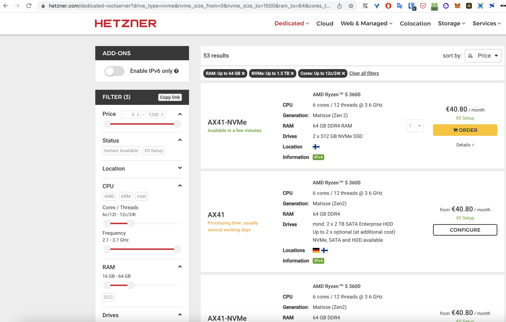
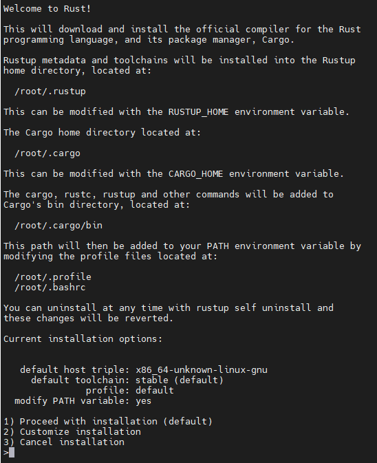
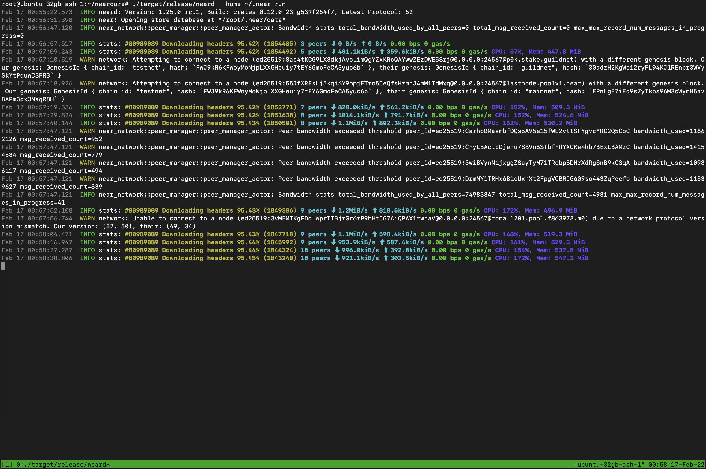
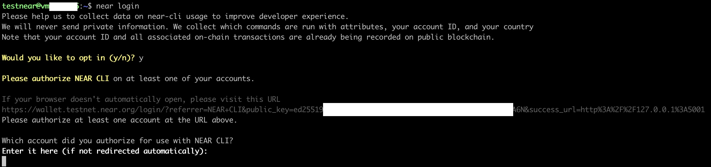
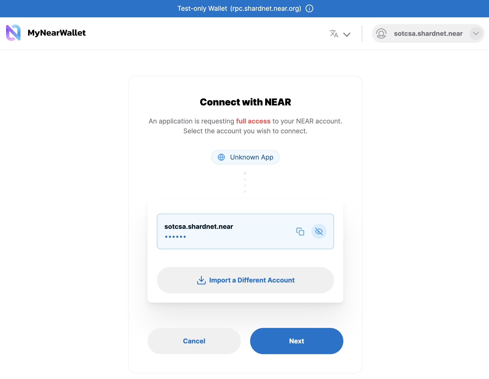
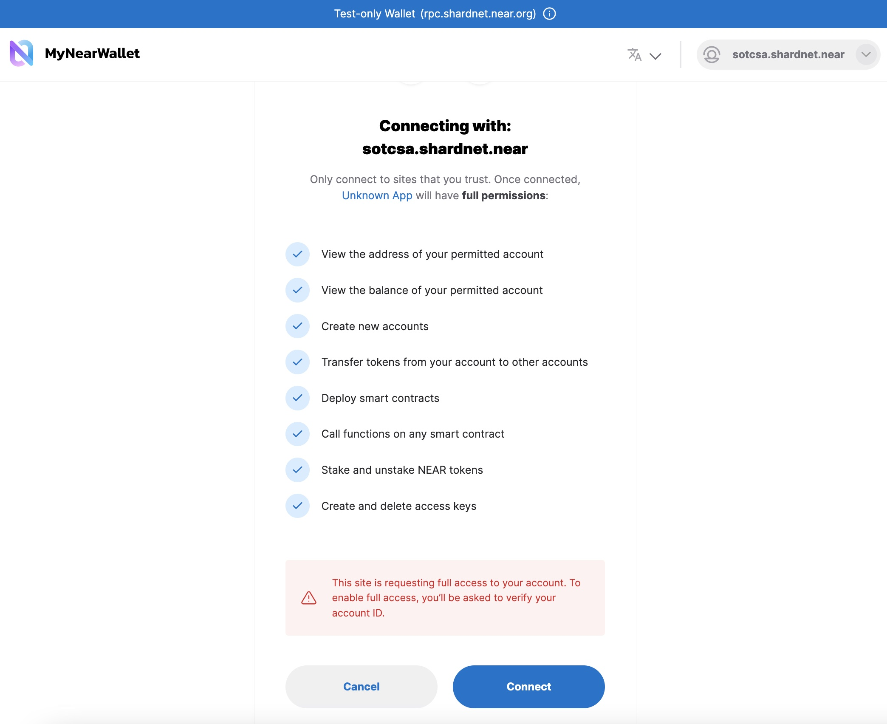
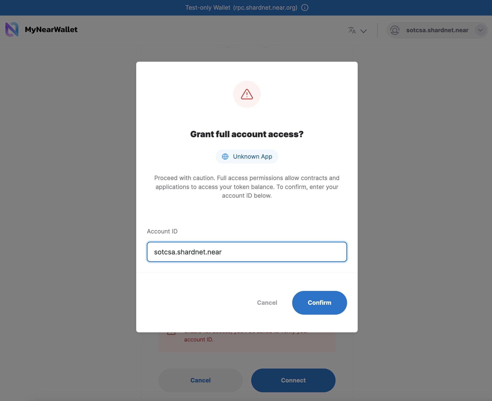
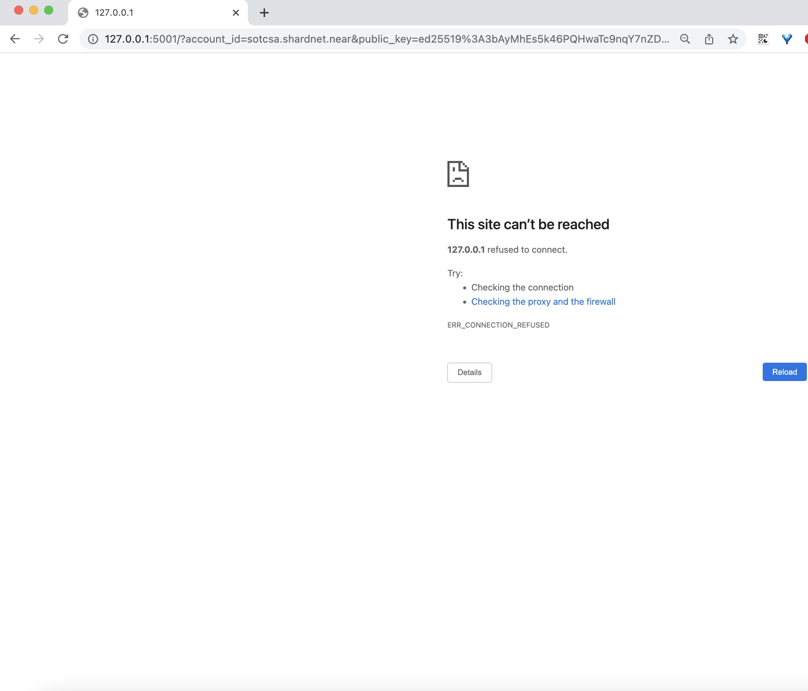
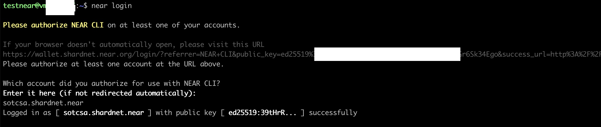

# Setup your node

## Server Requirements
Please see the hardware requirement below:

| Hardware       | Chunk-Only Producer  Specifications                                   |
| -------------- | ---------------------------------------------------------------       |
| CPU            | 4-Core CPU with AVX support                                           |
| RAM            | 8GB DDR4                                                              |
| Storage        | 500GB SSD                                                             |

## Select a Cloud server

Let's use a Dedicated server from Hetzner with NVME SSD .
> It's more than enough (CPU, RAM and NVMe), but it does worth for the better performance. 



There is no extra cost.

Estimated cost per month: **€40.80**

Without tax: **€34.00**

### Register in Hetzner with 4 steps
1) Sing-up here [here](https://accounts.hetzner.com/signUp)
2) Verify your email
3) Set your name, address, phone number
4) Set payment method

Go to the Robot page and select AX41-NVMe
https://robot.your-server.de/

For OS select 'Ubuntu 20.04.3 LTS minimal', the rest options default is good for us.


### Install
```
# Install developer and buil tools:
sudo apt install -y git binutils-dev libcurl4-openssl-dev zlib1g-dev libdw-dev libiberty-dev cmake gcc g++ python docker.io protobuf-compiler libssl-dev pkg-config clang llvm cargo clang build-essential make
```

#### Install Rust & Cargo
Ubuntu should contains Rust and Cargo, if not, please follow next steps

##### Install Rust & Cargo
```
curl --proto '=https' --tlsv1.2 -sSf https://sh.rustup.rs | sh
```

You will see the following:



Press 1 and press enter.

##### Source the environment
```
source $HOME/.cargo/env
```


#### Build from Source

```
# Clone from git
git clone https://github.com/near/nearcore
cd nearcore
git fetch

# checkout latest commitId
COMMIT_ID=$(curl -s https://raw.githubusercontent.com/near/stakewars-iii/main/commit.md)
# We are using the official latest commit id form https://github.com/near/stakewars-iii/blob/main/commit.md

git checkout $COMMIT_ID

# build/init
cargo build -p neard --release --features shardnet
./target/release/neard --home ~/.near init --chain-id shardnet --download-genesis

cd ~/.near
mv config.json config_renamed_original.json
wget -O ~/.near/config.json https://s3-us-west-1.amazonaws.com/build.nearprotocol.com/nearcore-deploy/shardnet/config.json
# genesis file is beside config, download it if needed

# aws cli
sudo apt-get install awscli -y

# start it and let it run to synch and catch-up
cd ~/nearcore
./target/release/neard --home ~/.near run
```


The node is now running you can see log outputs in your console. Your node should be find peers, download headers to 100%, and then download blocks.


#### Run neard

##### Setup an account to be used
```
#Setting IDs (e.g. sotcsa is my account name)
echo 'export ACCOUNT_NAME=sotcsa' >> ~/.bashrc
echo 'export ACCOUNT_ID=${ACCOUNT_NAME}.shardnet.near' >> ~/.bashrc >> ~/.bashrc
echo 'export POOL_NAME=${ACCOUNT_NAME}' >> ~/.bashrc
echo 'export POOL_ID=${POOL_NAME}.factory.shardnet.near' >> ~/.bashrc
```


```
# login, use your account id to allow near to use your wallet
near login
```

> Note: This command launches a web browser allowing for the authorization of a full access key to be copied locally.

1 – Copy the link in your browser






2 – Grant Access to Near CLI



3 – After Grant, you will see a page like this, go back to console



4 - You can ignore this page, browser can be close



5 – Enter your wallet (ACCOUNT_ID) and press Enter




#####  Check the validator_key.json
* Run the following command:
```
cat ~/.near/validator_key.json
```

> Note: If a validator_key.json is not present, follow these steps to create one

Create a `validator_key.json`

*   Generate the Key file:

```
near generate-key ${POOL_ID}
```
${POOL_ID} ---> xx.factory.shardnet.near WHERE xx is you pool name


```
# Store your PUBLIC_KEY as ENV variable
echo "export PUBLIC_KEY=$(cat .near-credentials/shardnet/${ACCOUNT_ID}.json | jq .public_key)" >> ~/.bashrc
```

* Copy the file generated to shardnet folder
```
mkdir -p ~/.near/
cp ~/.near-credentials/shardnet/${POOL_ID}.json ~/.near/validator_key.json
```
* Edit “account_id” => xx.factory.shardnet.near, where xx is your PoolName
* Change `private_key` to `secret_key`

> Note: The account_id must match the staking pool contract name or you will not be able to sign blocks.\

File content must be in the following pattern:
```
{
  "account_id": "xx.factory.shardnet.near",
  "public_key": "ed25519:HeaBJ3xLgvZacQWmEctTeUqyfSU4SDEnEwckWxd92W2G",
  "secret_key": "ed25519:****"
}
```


#####  Start the validator node

```
target/release/neard run
```
* Setup Systemd
  Command:

```
sudo vi /etc/systemd/system/neard.service
```
Paste:

```
[Unit]
Description=NEARd Daemon Service

[Service]
Type=simple
User=<USER>
#Group=near
WorkingDirectory=/home/<USER>/.near
ExecStart=/home/<USER>/nearcore/target/release/neard run
Restart=on-failure
RestartSec=30
KillSignal=SIGINT
TimeoutStopSec=45
KillMode=mixed

[Install]
WantedBy=multi-user.target
```

> Note: Change USER to your paths

Command:

```
sudo systemctl enable neard
```
Command:

```
sudo systemctl start neard
```
If you need to make a change to service because of an error in the file. It has to be reloaded:

```
sudo systemctl reload neard
```
###### Watch logs
Command:

```
journalctl -n 100 -f -u neard
```
Make log output in pretty print

Command:

```
sudo apt install ccze
```
View Logs with color

Command:

```
journalctl -n 100 -f -u neard | ccze -A
```
#### Becoming a Validator
In order to become a validator and enter the validator set, a minimum set of success criteria must be met.

* The node must be fully synced
* The `validator_key.json` must be in place
* The contract must be initialized with the public_key in `validator_key.json`
* The account_id must be set to the staking pool contract id
* There must be enough delegations to meet the minimum seat price. See the seat price [here](https://explorer.shardnet.near.org/nodes/validators).
* A proposal must be submitted by pinging the contract
* Once a proposal is accepted a validator must wait 2-3 epoch to enter the validator set
* Once in the validator set the validator must produce great than 90% of assigned blocks

Check running status of validator node. If “Validator” is showing up, your pool is selected in the current validators list.


## Next Step
[Mount your Staking Pool](./003.md).
