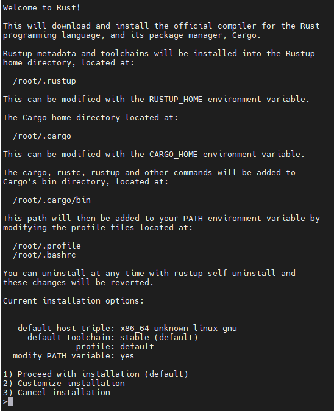
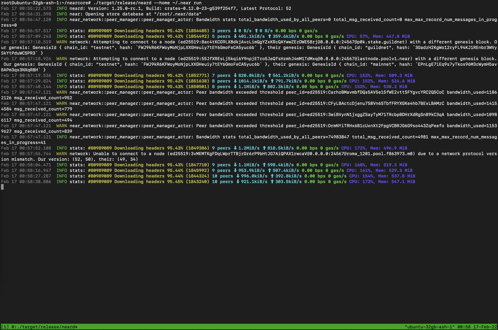
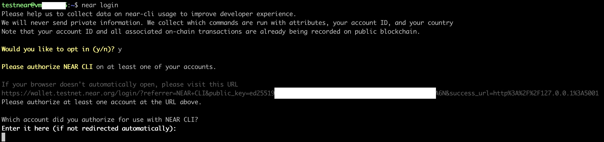

# Stake Wars: Episode III. 

## Challenge 001

### Create a wallet
https://wallet.shardnet.near.org/

Follow the instructions

### Setup NEAR-CLI
	
```
#Let's make sure the linux machine is up-to-date.
sudo apt update && sudo apt upgrade -y

# Install developer tools, Node.js, and npm
curl -sL https://deb.nodesource.com/setup_18.x | sudo -E bash -  
sudo apt install build-essential nodejs  -y
PATH="$PATH"

node -v
> v18.x.x

npm -v
> 8.x.x

# Install NEAR-CLI
sudo npm install -g near-cli
```

### Validator Stats
The environment will need to be set each time a new shell is launched to select the correct network.

```
echo 'export NEAR_ENV=shardnet' >> ~/.bashrc
```

Useful coommands
```
near proposals
near validators current
near validators next
```

## Challenge 002

### Setup your node
#### Server Requirements
Please see the hardware requirement below:

| Hardware       | Chunk-Only Producer  Specifications                                   |
| -------------- | ---------------------------------------------------------------       |
| CPU            | 4-Core CPU with AVX support                                           |
| RAM            | 8GB DDR4                                                              |
| Storage        | 500GB SSD                                                             |

### Select a Cloud server

Let's use a Dedicated server from Hetzner with NVME SSD


There is no extra cost.

Estimated cost per month: **€40.80**

For OS select 'Ubuntu 20.04.3 LTS minimal'


### Install 
```
# Install developer and buil tools:
sudo apt install -y git binutils-dev libcurl4-openssl-dev zlib1g-dev libdw-dev libiberty-dev cmake gcc g++ python docker.io protobuf-compiler libssl-dev pkg-config clang llvm cargo clang build-essential make
```

#### Install Rust & Cargo
Ubuntu should contains Rust and Cargo, if not, please follow next steps

##### Install Rust & Cargo
```
curl --proto '=https' --tlsv1.2 -sSf https://sh.rustup.rs | sh
```

You will see the following:



Press 1 and press enter.

##### Source the environment
```
source $HOME/.cargo/env
```


#### Build from Source

```
# Clone from git
git clone https://github.com/near/nearcore
cd nearcore
git fetch

# checkout latest commitId
COMMIT_ID=$(curl -s https://raw.githubusercontent.com/near/stakewars-iii/main/commit.md)
# We are using the official latest commit id form https://github.com/near/stakewars-iii/blob/main/commit.md

git checkout $COMMIT_ID

# build/init
cargo build -p neard --release --features shardnet
./target/release/neard --home ~/.near init --chain-id shardnet --download-genesis

cd ~/.near
mv config.json config_renamed_original.json
wget -O ~/.near/config.json https://s3-us-west-1.amazonaws.com/build.nearprotocol.com/nearcore-deploy/shardnet/config.json
# genesis file is beside config, download it if needed

# aws cli
sudo apt-get install awscli -y

# start it and let it run to synch and catch-up
cd ~/nearcore
./target/release/neard --home ~/.near run
```


The node is now running you can see log outputs in your console. Your node should be find peers, download headers to 100%, and then download blocks.


#### Run neard

##### Setup an account to be used
```
#Setting IDs (e.g. sotcsa is my account name)
echo 'export ACCOUNT_NAME=sotcsa' >> ~/.bashrc
echo 'export ACCOUNT_ID=${ACCOUNT_NAME}.shardnet.near' >> ~/.bashrc >> ~/.bashrc
echo 'export POOL_NAME=${ACCOUNT_NAME}' >> ~/.bashrc
echo 'export POOL_ID=${POOL_NAME}.factory.shardnet.near' >> ~/.bashrc
```


```
# login, use your account id to allow near to use your wallet
near login
```
#### Teminal - login start


#### Web - select the created wallet


#### Web - connect the created wallet


#### Web - confirm


#### Web - You can ignore this page, browser can be close


#### Teminal - enter the your ACCOUNT_ID to complete login.


Go back to the terminal and enter the your ACCOUNT_ID to complete login.

```
# generate validator keys
near generate-key ${pool_name}.factory.shardnet.near
# copy generated key to its place
cp ~/.near-credentials/shardnet/${accountId}.shardnet.near.json ~/.near/validator_key.json
# Change in validator_key.json private_key to secret_key

# Store yuor PUBLIC_KEY as ENV variable
echo "export PUBLIC_KEY=$(cat .near-credentials/shardnet/sotcsa.shardnet.near.json | jq .public_key)" >> ~/.bashrc

```


# Set up service as daemon

```
# run in a screen manually
target/release/neard run

# or create a service daemon
sudo vi /etc/systemd/system/neard.service
```
Paste and replace < userId >
```
[Unit]
Description=NEARd Daemon Service

[Service]
Type=simple
User=<userId>
#Group=near
WorkingDirectory=/home/<userId>/.near
ExecStart=/home/<userId>/nearcore/target/release/neard run
Restart=on-failure
RestartSec=30
KillSignal=SIGINT
TimeoutStopSec=45
KillMode=mixed

[Install]
WantedBy=multi-user.target
```

```
sudo systemctl enable neard
sudo systemctl start neard
# check log
sudo journalctl -n 100 -f -u neard | ccze -A

```

### Create Staking pool, deposit, ping, check results

```
# Create staking pool
near call factory.shardnet.near create_staking_pool '{"staking_pool_id": "'${POOL_NAME}'", "owner_id": "'${ACCOUNT_ID}'", "stake_public_key": "'${PUBLIC_KEY}'", "reward_fee_fraction": {"numerator": 5, "denominator": 100}, "code_hash":"DD428g9eqLL8fWUxv8QSpVFzyHi1Qd16P8ephYCTmMSZ"}' --accountId="'${ACCOUNT_ID}'" --amount=30 --gas=300000000000000

# Deposit and stake NEAR
near call ${POOL_ID} deposit_and_stake --amount 460 --accountId ${ACCOUNT_ID} --gas=300000000000000

# Get staked balance
near call ${POOL_ID} get_account_staked_balance '{"account_id": "'${ACCOUNT_ID}'"}'

# Create proposal with ping
near call ${POOL_ID} ping '{}' --accountId ${ACCOUNT_ID} --gas=300000000000000	

# Check validator is within proposals
near proposals | grep ${POOL_NAME}
```
