## Step 1 - Install InfluxDB

```
# Add the influxdata Key.
sudo curl -sL https://repos.influxdata.com/influxdb.key | sudo apt-key add -

# Add the influxdata repository.
source /etc/lsb-release
echo "deb https://repos.influxdata.com/${DISTRIB_ID,,} ${DISTRIB_CODENAME} stable" | sudo tee /etc/apt/sources.list.d/influxdb.list

# Now update the repository and install the 'influxdb' package 
sudo apt update
sudo apt install influxdb -y

sudo systemctl start influxdb
sudo systemctl enable influxdb
```

## Step 2 - Create InfluxDB Database and User

```
influx

create database telegraf
create user telegraf with password 'password-of-telegraf-user'

# Now check the database and user.
show databases
show users
```

Make sure you get the database and user named 'telegraf' on the influxdb server.

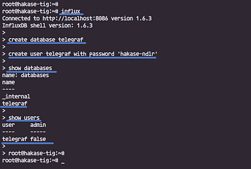

## Step 3 - Install Telegraf Agent

```shell
sudo apt install telegraf -y

sudo systemctl start telegraf
sudo systemctl enable telegraf

sudo systemctl status telegraf
```
The telegraf agent is up and running, check status

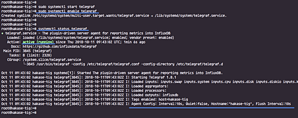


## Step 4 - Configure Telegraf

Go to the '/etc/telegraf' directory and rename the default configuration file.

```shell
cd /etc/telegraf/
sudo mv telegraf.conf telegraf.conf.default
sudo vim telegraf.conf
```

Paste configurations below.
```
# Global Agent Configuration
[agent]
hostname = "change-tig-stakc-hoosname"
flush_interval = "15s"
interval = "15s"


# Input Plugins
[[inputs.cpu]]
percpu = true
totalcpu = true
collect_cpu_time = false
report_active = false
[[inputs.disk]]
ignore_fs = ["tmpfs", "devtmpfs", "devfs"]
[[inputs.io]]
[[inputs.mem]]
[[inputs.net]]
[[inputs.system]]
[[inputs.swap]]
[[inputs.netstat]]
[[inputs.processes]]
[[inputs.kernel]]

# Output Plugin InfluxDB
[[outputs.influxdb]]
database = "telegraf"
urls = [ "http://127.0.0.1:8086" ]
username = "telegraf"
password = "password-of-telegraf-user"
```
Save and exit.

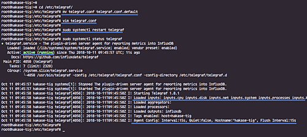

> **Note**
> 
> Telegraf provides telegraf command to manage the configuration, including generate the configuration itself, run the command as below.

```
telegraf config -input-filter cpu:mem:disk:swap:system -output-filter influxdb > telegraf.conf
cat telegraf.conf
```

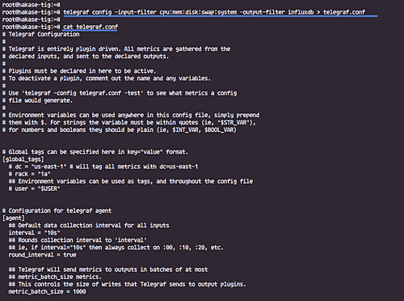

```shell
#Restart the telegraf service and make sure there is no error.
sudo systemctl restart telegraf
```

Now test the telegraf settings using the command below.

```shell
sudo telegraf -test -config /etc/telegraf/telegraf.conf --input-filter cpu
sudo telegraf -test -config /etc/telegraf/telegraf.conf --input-filter net
sudo telegraf -test -config /etc/telegraf/telegraf.conf --input-filter mem
```

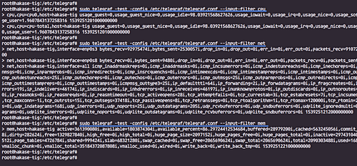

## Step 6 - Install Grafana

```shell
sudo curl https://packages.grafana.com/gpg.key | sudo apt-key add -
sudo add-apt-repository "deb https://packages.grafana.com/oss/deb stable main"

sudo apt install grafana -y

sudo systemctl start grafana-server
sudo systemctl enable grafana-server
```

## Step 7 - Setup Grafana Data Source

Open your web browser and type the server IP address with port 3000.

http://54.246.255.12:3000/

Login with the default user 'admin' and password 'admin'.

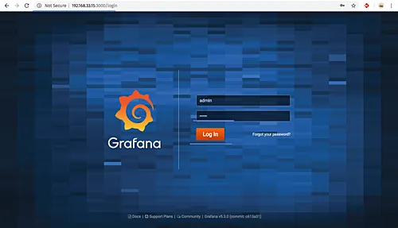

Now you will be prompted with the page for changing the default password, type your new password and click the 'Save' button.

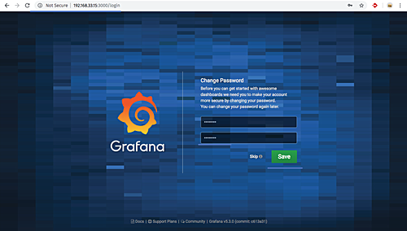

And you will be redirected to the default Grafana Dashboard.

Click the 'Add data source' button to add the influxdb data source.

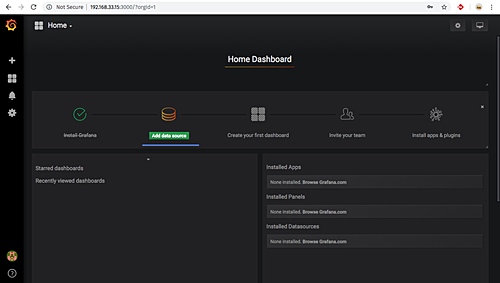

Type details about the influxdb server configurations.

* Name: influxdb
* Type: influxdb
* URL: http://localhost:8086/

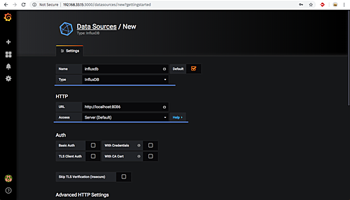

Scroll to the bottom page and type details of influxdb database settings.

* Database: telegraf
* User: telegraf
* Password: 'password-of-telegraf-user'

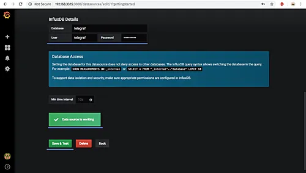

Click the 'Save and Test' button and make sure you get the 'Data source is working' result.

The InfluxDB data source has been added to the Grafana server.

## Step 8 - Setup Grafana Dashboard

To import the grafana dashboard, click on the '+' menu on the left panel and click 'Import'.

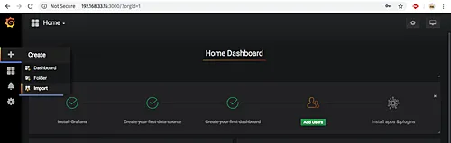

Now open the sample Grafana dashboard from URL 'https://grafana.com/dashboards/5955' and click the 'Copy the ID to Clipboard' button.

Paste the dashboard id.

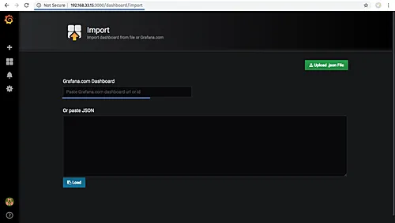

And you will be redirected automatically to the dashboard setup.

On the options section, click the InfluxDB and choose your influxdb server, then click 'Import' button.

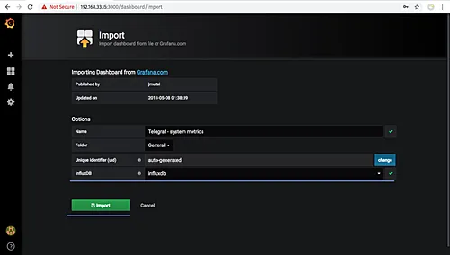

And below are some screenshots from the imported dashboard.

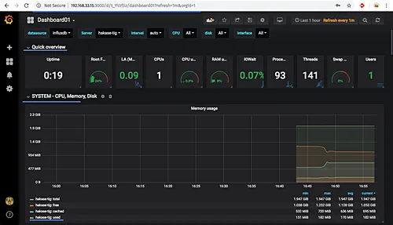

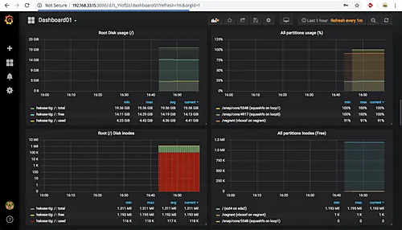

## Create your own dashboard

You can use a near specific telegraf scripts to send data about your node.

Here is my setup:

* Download this [script](https://github.com/sotcsa/stakewars-iii/blob/main/near-telegraf-collector.sh) (change IP if necessary, see comments in script) to /usr/local/bin/near-telegraf-collector.sh
* Make it executable (chmod 755 /usr/local/bin/near-telegraf-collector.sh)
* Configure telegraf 

Add these lines to /etc 
```
[[inputs.exec]]
  commands = [
     "/usr/local/bin/near-telegraf-collector.sh"
  ]
  interval = "60s"
  timeout = "60s"
  json_name_key = "measurement"
  json_time_key = "time"
  tag_keys = [
    "validator_name"
  ]

  json_string_fields = [
    "near_version",
    "near_version_commit_id",
    "chain_id",
    "validator_account_id",
    "node_key",
    "fields_syncing",
    "fields_epoch_id"
  ]

  json_time_format = "unix"
```

* Restart telegraf
```shell
sudo systemctl restart telegraf

#check status
sudo systemctl status telegraf
```

Wait some minutes and you can create a dashboard (see above) with the sent data

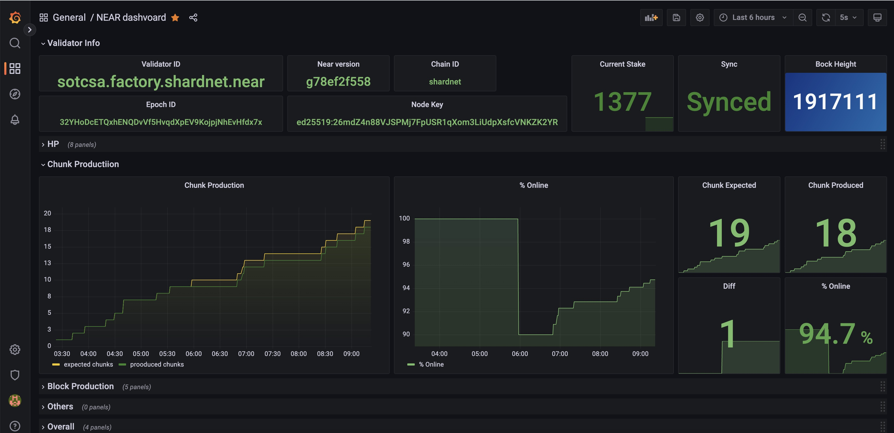
